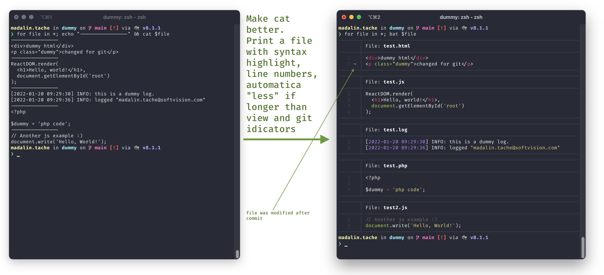

# Make cat not suck by using bat.





Cat sucks. Enter [bat](https://github.com/sharkdp/bat)

#### Install

```shell
brew install bat
```


#### Replace cat (optional) by adding the following your `~/.zshrc` (`~/.bashrc`, `~/.config/fish/config.fish`)

```shell
alias cat='bat'
```


🔥TIP: there are many [other configuration and customizations](https://github.com/sharkdp/bat#customization) that you can use with bat.


#### Enjoy!:)
