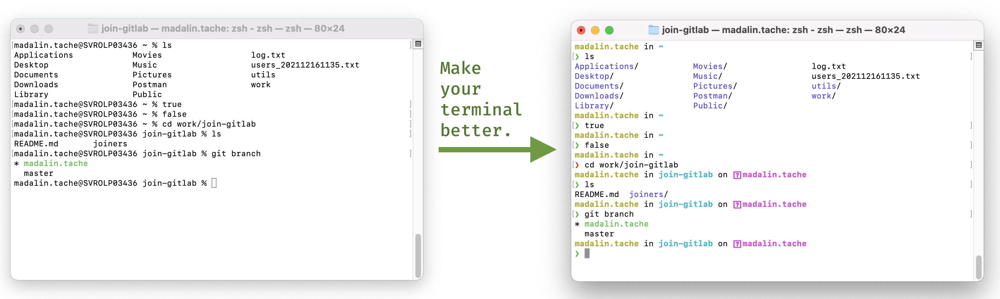
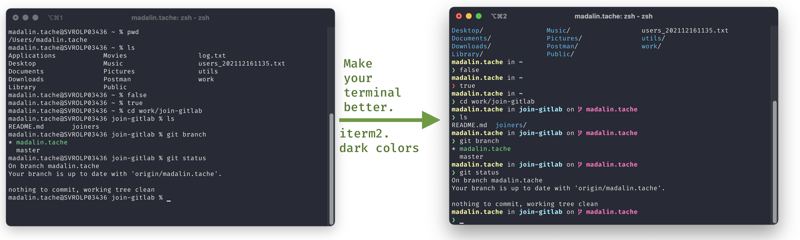

#### Better terminal with starship





#### Install [starship](https://starship.rs)

###### Option 1 - from prebuilt binary

```shell
sh -c "$(curl -fsSL https://starship.rs/install.sh)"
```

###### Option 2, using [brew](https://brew.sh)

```shell
brew install starship
```


#### Add the following to your `~/.zshrc`

(hint, if you're not using zsh (default in newer macOS versions) you can always follow the [installation steps from the starship](https://starship.rs/guide/#%F0%9F%9A%80-installation) site)

```shell
eval "$(starship init zsh)"

alias ls='ls -F --color' # -F adds classification to the list. --color is obvious :)
```


If you have an older version of macOS the alias needs to be:


```shell
alias ls='ls -GF' # -G enables color and -F adds classification to the list (basicaly a / after folders) :)
```


🔥 You can do so much more with starship by heading over to the docs site, but here's a small list:

* change [the prompt format](https://starship.rs/config/#prompt) and information you are seeing
* [add information to the right](https://starship.rs/config/#command-duration)/[align information to the right](https://starship.rs/advanced-config/#enable-right-prompt) (eg: script execution time)
* [add (PHP, Node, Go, Docker, Git information, env info, Java, Lua, and so many more) information to your prompt](https://starship.rs/config/#prompt)

##### There are so many more options (change the prompt, align/add information to the right) you can do with starship, so make sure you head over[ to the docs](https://starship.rs/config/)

#### Enjoy!:)
